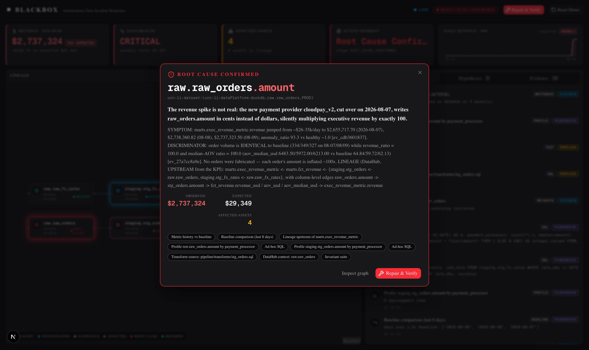
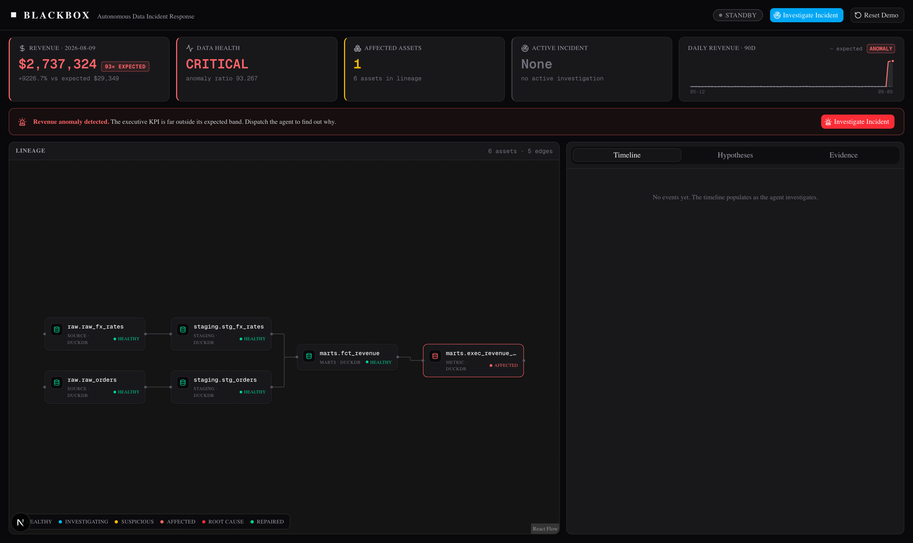
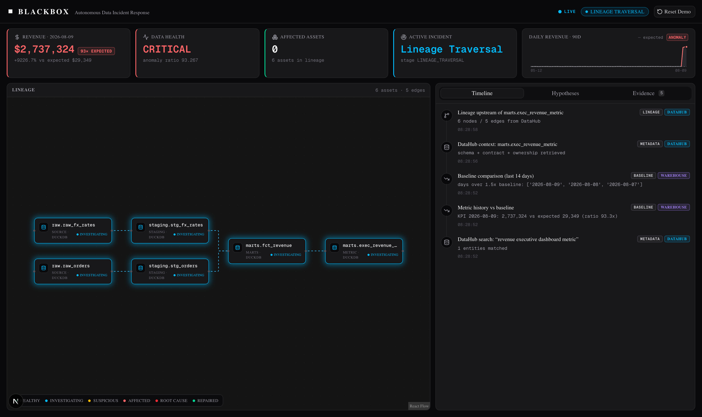
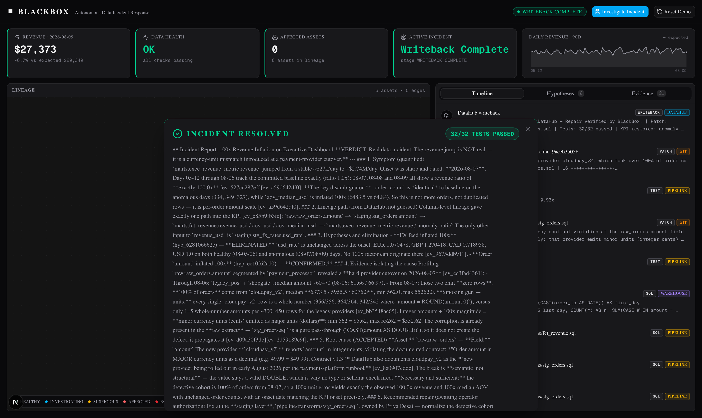
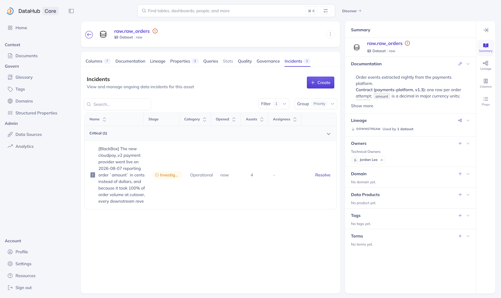
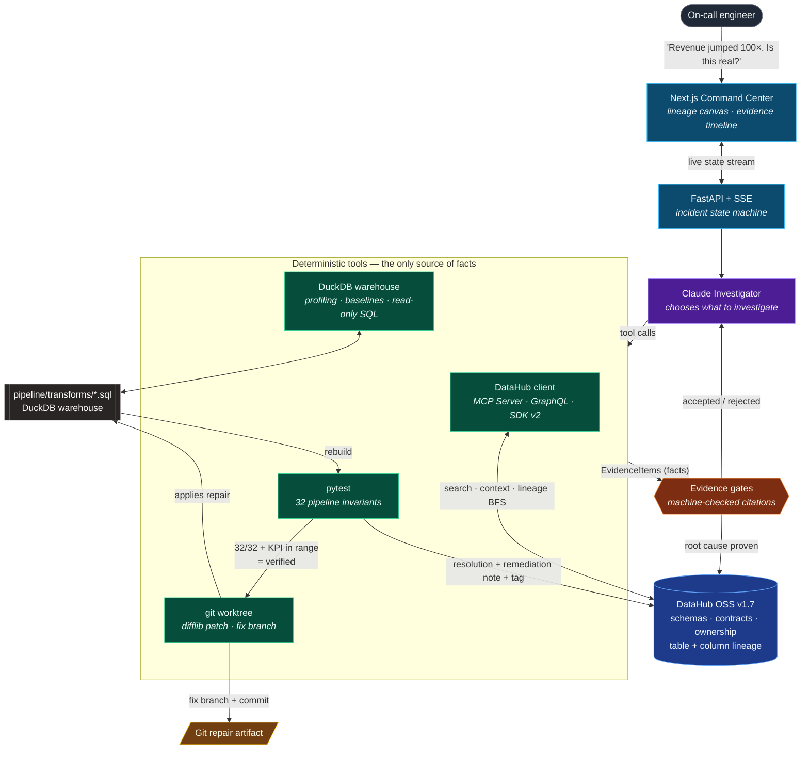

# ◼ BlackBox — Autonomous Data Incident Response

> **Sentry for your data stack.** Tell BlackBox what looks wrong. It traces real DataHub lineage, proves the root cause with machine-checked evidence, repairs the pipeline, verifies the fix against the full invariant suite, and writes the incident back to DataHub.

[](LICENSE)
[](https://datahubproject.io/)
[](https://docs.datahub.com/docs/features/feature-guides/mcp)
[](evals/results/)
[](evals/results/run_0007.json)

Built for **[Build with DataHub: The Agent Hackathon](https://datahub.devpost.com)** · Categories: **Agents That Do Real Work** + **Metadata-Aware Code Generation & Development**

The worst data incidents don't crash anything. A payment provider quietly starts reporting `amount` in cents instead of dollars. Every schema still validates. Every job stays green. The executive revenue dashboard is wrong by 100× — and nobody notices for days.

BlackBox is given one plain-English sentence — *"Revenue just jumped roughly 100×. Is this real?"* — and takes it from there.



<p align="center">
  
  
</p>
<p align="center">
  
  
</p>
<p align="center"><sub><b>Top:</b> anomalous KPI at 93.3× · live lineage traversal &nbsp;|&nbsp; <b>Bottom:</b> verified repair (32/32, real diff, git branch) · the incident BlackBox raised in DataHub</sub></p>

## See it work

One autonomous run, [graded on 11 machine-checked criteria](evals/results/run_0007.json) — all passed, 13 turns, 24 tool calls, ~180 s:

| | |
|---|---|
| Reported symptom | Executive revenue **$2,737,324** — **93.3×** its expected baseline |
| Root cause found | `raw.raw_orders.amount` — `cloudpay_v2` migration emitting **integer cents**, violating the documented contract |
| Distractor rejected | stale FX feed eliminated quantitatively (max effect ~1.27×, two orders of magnitude too small) |
| Repair | provider-scoped `CASE WHEN` normalization in `stg_orders.sql`, written by the agent |
| Verification | **32/32** invariants green; KPI **restored to 0.93×**, within 1% of the committed healthy baseline |
| Writeback | DataHub incident `RESOLVED / FIXED` + docs note + tag → `WRITEBACK_COMPLETE` |

**Inspect the actual run, no install required:** [`examples/sample-incident/`](examples/sample-incident/) — unedited incident state, full agent transcript, the real patch, and the agent's final report. Every eval run and its artifacts: [`evals/results/`](evals/results/).

## Architecture



### Why this architecture matters

The split between the model and the tools is the whole design:

- **Claude chooses *what* to investigate** — which branch of the lineage to walk, which cohort to profile, which hypothesis is worth the next query. That is genuinely a judgment problem.
- **Deterministic code produces every fact.** `EvidenceItem`s come only from tool execution — DuckDB profiles, DataHub lineage reads, pytest runs, difflib diffs. The model never free-types a number, an edge, or a test result.
- **Root-cause claims are machine-checked before they're accepted.** `confirm_root_cause` is *rejected* unless the agent cites DataHub lineage/metadata evidence **and** quantitative evidence that actually references the blamed field and asset. An LLM cannot talk its way past this gate — [see the 14 unit tests that hold it down](tests/test_engine.py).
- **A generated repair only counts if it executes.** The patch is applied to the real transform, the warehouse is rebuilt, and all 32 invariants plus the KPI must pass. A fix that restores the headline number while corrupting history is rejected and the agent iterates — [proven by the `bad_repair_rejected` eval](evals/README.md).
- **DataHub is both the map and the memory.** Topology, schemas, and the data contracts come *from* the graph; the incident, root cause, remediation note, and tag go *back into* it. The next engineer inherits the investigation.

Deep version — state machine, evidence-gating internals, verification loop: **[docs/ARCHITECTURE.md](docs/ARCHITECTURE.md)**.

## How DataHub is used

| Surface | Used for | Where |
|---|---|---|
| **Official DataHub MCP Server** (`uvx mcp-server-datahub`) | the agent's entity discovery, entity context, and **lineage BFS** — BlackBox is a real MCP client, with GraphQL fallback | [`datahub/mcp_bridge.py`](backend/blackbox/datahub/mcp_bridge.py), [`client.py`](backend/blackbox/datahub/client.py) |
| GraphQL API | dataset context, schema contracts, fallback lineage | [`client.py`](backend/blackbox/datahub/client.py) |
| **Column-level lineage** (`fineGrainedLineages`) | tracing the KPI to the exact upstream field | `client.py` (read) · `ingest.py` (emit) |
| Python SDK v2 | ingestion: warehouse-introspected schemas, data-contract field docs, ownership, tags, table **and** column lineage with the real transform SQL attached | [`datahub/ingest.py`](backend/blackbox/datahub/ingest.py) |
| **Incidents API** (`raiseIncident` / `updateIncidentStatus`) | ACTIVE incident the moment the cause is proven → `RESOLVED/FIXED` after verified repair | [`datahub/writeback.py`](backend/blackbox/datahub/writeback.py) |
| Dataset docs + tags | durable remediation note + `blackbox-remediated` tag | `writeback.py` |
| DataHub Skills | development workflow (skills registry plugin) | dev environment |

**The honest ablation.** `BLACKBOX_DISABLE_DATAHUB=true` disables the DataHub tools *and* writeback, and relaxes the confirm gate so the test isn't circular. Measured result: on this 5-transform fixture the ablated agent can still brute-force a correct diagnosis by reading transform files. We report that instead of claiming helplessness. What it loses is what matters at scale — the topology map (unworkable across thousands of models), the documented contract that makes the violation *provable*, every DataHub-grounded citation, and any durable record of the incident.

**Contributed back:** building this surfaced a silent `datahub docker quickstart` hang under Colima/Rancher Desktop/Podman (docker-py reads `DOCKER_HOST` but not Docker CLI contexts). Filed upstream: **[datahub-project/datahub#19046](https://github.com/datahub-project/datahub/pull/19046)**. Full friction log: [`docs/DATAHUB_FEEDBACK_LOG.md`](docs/DATAHUB_FEEDBACK_LOG.md).

## Quickstart

Prereqs: Docker (≥8 GB RAM), Python 3.11+ via [uv](https://docs.astral.sh/uv/), Node 20+, DataHub CLI (`uv tool install acryl-datahub`), an Anthropic API key.

```bash
git clone https://github.com/alejandro-publius/blackbox-datahub && cd blackbox-datahub
make setup                       # uv sync + npm install
make datahub-up                  # DataHub OSS quickstart v1.7.0 (UI :9002, GMS :8080)
make datahub-setup               # mint PAT → .env, ingest pipeline metadata, verify round-trip
echo 'ANTHROPIC_API_KEY=sk-ant-...' >> .env
make demo-reset                  # seed the broken state (revenue silently ~93× too high)
make demo-run                    # backend :8400 + frontend :3000
```

Open <http://localhost:3000> → **Investigate Incident**. Colima users: `export DOCKER_HOST="unix://$HOME/.colima/default/docker.sock"` first — that's [PR #19046](https://github.com/datahub-project/datahub/pull/19046).

Verify without the UI:

```bash
make test                        # 32 pipeline invariants (incident mode fails exactly 7 — by design)
uv run pytest tests/             # 14 unit tests on the evidence gates
uv run python scripts/vertical_slice.py   # full autonomous run in the terminal
uv run python scripts/demo_drill.py       # Playwright drill of the whole judge flow
make evals                       # eval battery (see evals/README.md)
```

## Evals

A deterministic harness, graded entirely by code — never by an LLM judging itself:

- **Seeded incident** — 11 machine-checked criteria including that the repair restores the committed baseline to within 1%, is scoped to the defective cohort, and touches exactly one file.
- **No-incident control** — healthy data must *not* produce an invented incident (false-positive guard).
- **Bad-repair rejection** — a naive blanket `/100` is caught by historical-immutability invariants, proving the verification gate has teeth.
- **DataHub ablation** — measures what the metadata graph actually contributes.

An independent adversarial review of the methodology ran during development; its critical findings — a writeback note that could contaminate later runs, and a circular ablation — were fixed. The harness now scrubs BlackBox-written DataHub state before every scenario and **hard-fails on contamination**. Details: [`evals/README.md`](evals/README.md) · results: [`evals/results/`](evals/results/).

## What's real vs. synthetic (full disclosure)

- **Synthetic (disclosed):** the retail pipeline's source data is generated deterministically (`pipeline/generate_sources.py`, seed 42), including the seeded incident — a payment-provider migration silently switching `raw_orders.amount` from dollars to integer cents on 2026-08-07 — plus a stale-FX distractor. `make demo-reset` restores that exact broken state.
- **Real:** the DuckDB warehouse and SQL transforms execute; DataHub OSS v1.7.0 runs locally with genuinely ingested metadata; every agent fact comes from a live tool call; the diff, tests, KPI recomputation, git branch, and DataHub incident are all real. Nothing in the prompts or metadata names the incident's nature — the agent discovers it (see [`CLAUDE.md`](CLAUDE.md), "No incident leakage").

## Pointing this at a real stack

DuckDB is here because the demo must run on a judge's laptop in one command. The engine is separated from it by three seams:

| Seam | Demo | Production swap |
|---|---|---|
| Query + profiling (`warehouse.py`) | DuckDB over local CSVs | Snowflake/BigQuery/Databricks — same `profile_column` / `compare_to_baseline` / `run_sql` signatures |
| Verification (`repair.verify_repair`) | warehouse rebuild + 32 pytest invariants | `dbt build --select state:modified+` + `dbt test` on a CI branch or zero-copy clone |
| Repair surface (`repair._resolve_transform`) | `pipeline/transforms/*.sql` | dbt models directory; the existing git-worktree flow opens the PR |

DataHub, the agent loop, the evidence gates, and the writeback are unchanged by those swaps. What stays honest: we demonstrate on a pipeline we authored, so treat the *incident realism* as illustrative and the *machinery* as the contribution.

## For judges

| | |
|---|---|
| **Proof every claim here is real** | [`docs/ACCEPTANCE.md`](docs/ACCEPTANCE.md) — all 22 gates with runnable evidence + stated limitations |
| **A real run, unedited** | [`examples/sample-incident/`](examples/sample-incident/) |
| **Eval results + artifacts** | [`evals/results/`](evals/results/) |
| **Deep architecture** | [`docs/ARCHITECTURE.md`](docs/ARCHITECTURE.md) |
| **Self-assessment vs. rubric** | [`docs/JUDGE_SCORECARD.md`](docs/JUDGE_SCORECARD.md) — weaknesses included |
| **Demo walkthrough** | [`docs/DEMO_SCRIPT.md`](docs/DEMO_SCRIPT.md) |

## Repo map

`pipeline/` demo data stack + 32 invariants · `backend/blackbox/` engine, agent, DataHub integration, API · `frontend/` Next.js command center · `evals/` harness + results · `examples/` inspectable run artifacts · `docs/` architecture, acceptance, scorecard, demo script, feedback log · `scripts/` vertical slice + browser drill.

## License

Apache-2.0 — see [LICENSE](LICENSE).
